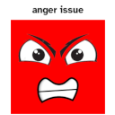

# Anger Issue library (kind of) mod for Minecraft Forge 1.7.10

## Description
This mod is for now a simple mixin that makes configured mobs able to deal damage. It does not make them neutral,
it only adds attack damage code to their attack method. This means, if an animal doesn't attack for some reason,
this mod will have no effect. I intend to add this functionality eventually. For now, the mod is useful for my other
mod, `Eyes in the Shadows`. There you can configure any mob to attack the Eyes, and animals are not able to deal any
damage.
I advise to use my mod `ConfigMaxxing` to configure the list of affected mobs more easily.
For now, only one damage value can be configured, I eventually want to develop a config system (with gui, obviously)
where arbitrary values can be grouped together (in this case `string` and `float`, mob name and damage).

This mod requires the [FalsePatternLib](https://www.curseforge.com/minecraft/mc-mods/fplib).
This mod requires a mixin lib provider, like [GasStation](https://www.curseforge.com/minecraft/mc-mods/gasstation).